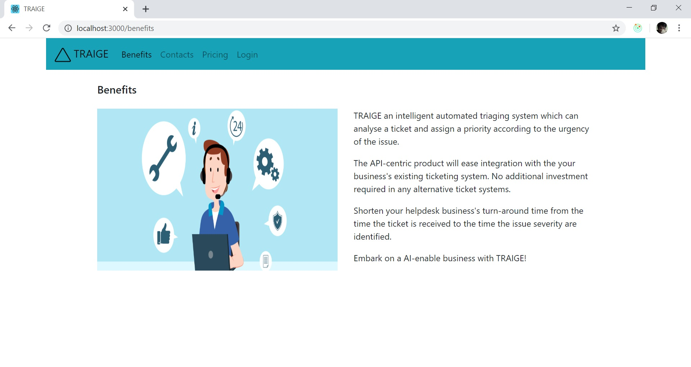

## SECTION 1 : PROJECT TITLE
## TRAIGE - AI-ENABLED TRIAGING SYSTEM

---

## SECTION 2 : EXECUTIVE SUMMARY / PAPER ABSTRACT
Customer service across all industries, struggles with the high volume of incoming tickets at one point or other.  For organizations without the ability to manage spikes in response demand, the service level and satisfaction of customers goes down rapidly and results in unnecessary escalations which could have been avoided efficiently.

While computer systems have evolved to offer an elastic mode in processing power and storage space, the human workforce is fixed.  This is due to the cost involved in hiring and the turn-around time to get someone onboard and train (typically 8-12 weeks). These customer service agents need to deal with tickets which fall outside the scope of self-help FAQs and the popular chatbots.  

Traditionally, this process is reactive. There are a lot of administrative steps in that process, causing layers of inefficiencies.  Urgent cases get piled up behind in the queue since the end user will perceive even a simple problem as a major issue.

The support queues require a triaging process like an accident & emergency center in a hospital.  All new incoming patients are screened using standard practices and a decision is made by the triage nurse on the criticality so that they can be placed in the queue appropriately.

The proposed solution is to build an intelligent triage process which can take in some rules input by the relevant experienced customer service managers to classify the severity of the incoming tickets before assigning to the customer service agent.  The system will read through the content of the ticket and flag them with various criticalities as defined by the customer service managers.  

---

## SECTION 3 : CREDITS / PROJECT CONTRIBUTION

| Official Full Name | Work Items (Who Did What) | 
| :------------ |:---------------:| 
| Tng Sian Soo | Solutioning, Design and Development |
| Kumaravelu Varadharajan  |Business Development Marketing | 

---

## SECTION 4 : VIDEO 

---

## SECTION 5 : USER GUIDE

`Refer to appendix <Installation & User Guide> in project report at Github Folder: ProjectReport`

### [ 1 ] Install additional necessary libraries. This application works in Python 3 and Java > 8 only.

> Ensure Java.exe is in classpath

> pip install flask pandas pickle scipy joblib

### [ 2 ] To run the system using Windows OS

> download deploy.zip from https://github.com/sawnwink/IRS_PM_TRAIGE/releases into your machine.

> unzip deploy.zip 

> Run startWebService.bat 

> Edit startApplication.bat. Edit call <pathto>/activate <your python environment> based on your settings.

> Run startApplication.bat and the TRAIGE App will be displayed in the browser. 

---
## SECTION 6 : PROJECT REPORT / PAPER

`Refer to project report at Github Folder: ProjectReport`

**Recommended Sections for Project Report / Paper:**
- Executive Summary / Paper Abstract
- Business Problem Background
- Market Research
- Project Objectives & Success Measurements
- Project Solution (To detail domain modelling & system design.)
- Project Implementation (To detail system development & testing approach.)
- Project Performance & Validation (To prove project objectives are met.)
- Project Conclusions: Findings & Recommendation
- Appendix of report: Project Proposal
- Appendix of report: Mapped System Functionalities against knowledge, techniques and skills of modular courses: MR, RS, CGS
- Appendix of report: Installation and User Guide
- Appendix of report: 1-2 pages individual project report per project member, including: Individual reflection of project journey: (1) personal contribution to group project (2) what learnt is most useful for you (3) how you can apply the knowledge and skills in other situations or your workplaces

## SECTION 7 : MISCELLANEOUS

`Refer to Github Folder: Miscellaneous`

### triage-rules.drl
* Rules which were used in our system

